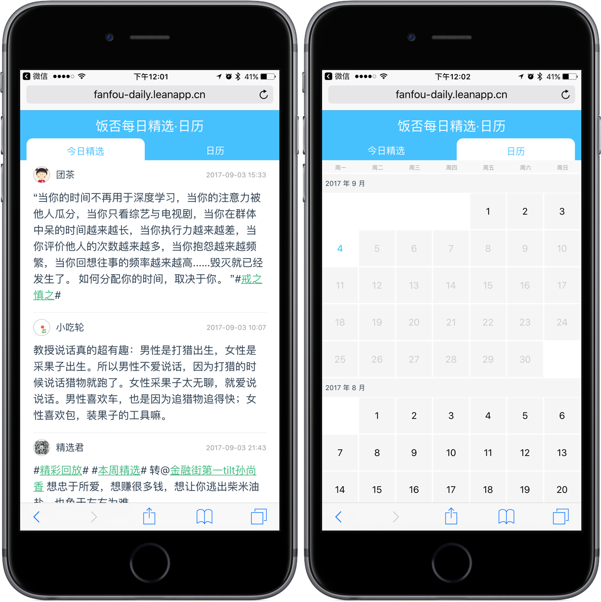

  <h1>饭否每日精选·日历 | vue-fanfou-daily</h1>
  

    
       
    <a href="http://fanfou-daily.leanapp.cn/d/today">在线访问地址</a>
   

___

1. 花了个周末把之前制作的没有审核通过的「饭否每日精选·日历」小程序转换成了 Web 版；
2. v1.0.0 于 2017-09-04 上午完成线上部署；
3. 具体部署在 LeanCloud 上，在线访问地址在此[链接](http://fanfou-daily.leanapp.cn/d/today)；
4. 项目中：
    1. 服务器端用 Express + CornJob 定时抓取饭否精选的数据，提供给前台数据；
    2. 前端主要使用 Vue.js + Vuex + Vue-Router 实现。

___

## 使用
需要去 LeanCloud 上申请一个 app，将对应的 APP_ID 和 APP_KEY 填入 `config/api.config.js` 中。然后就是终端中运行 `npm run dev:client`。
