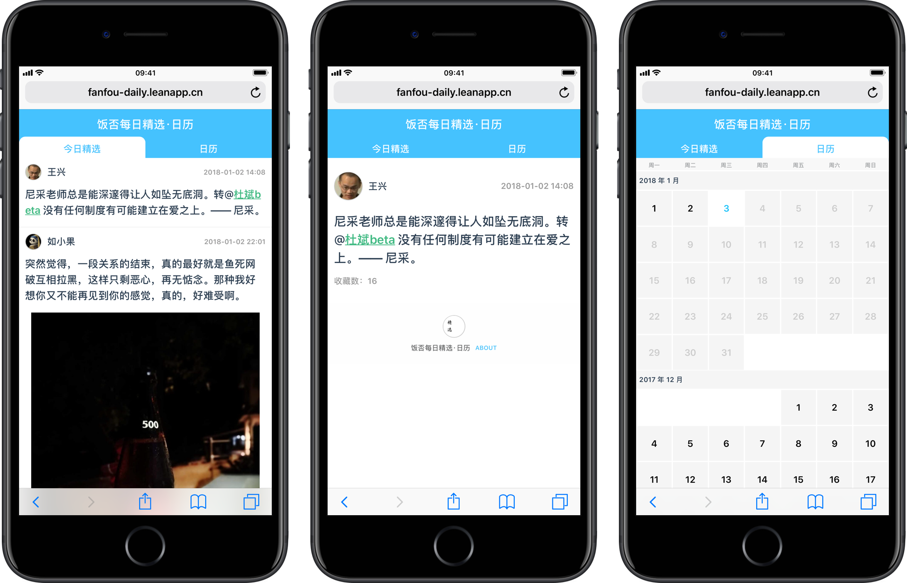
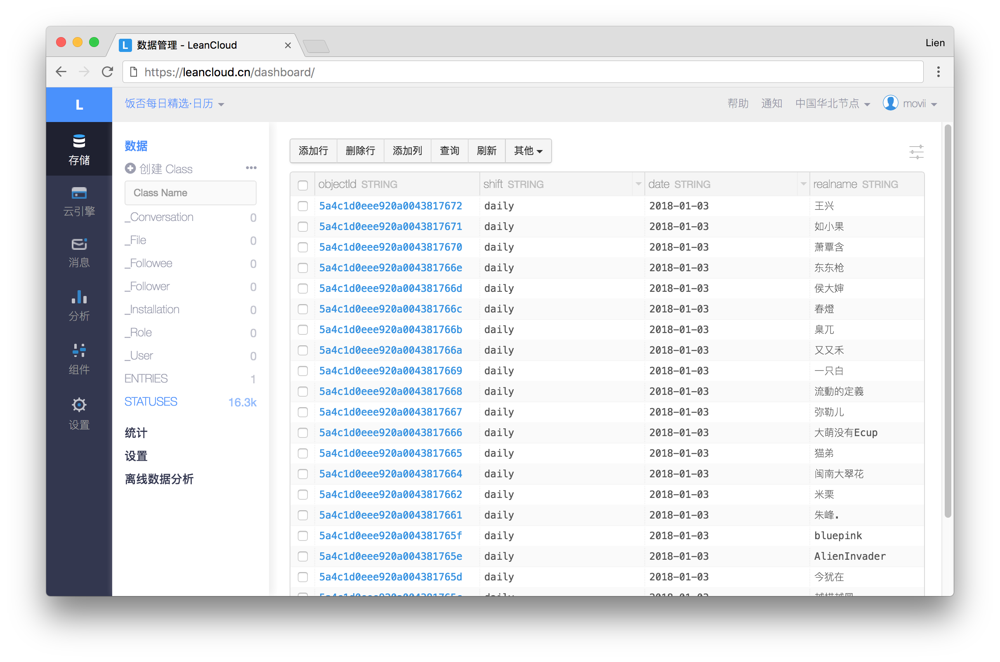

<div align="center" markdown="1">
  <h1>饭否每日精选·日历 | vue-fanfou-daily</h1>
  <br>
  <div align="center">
    
    <br/><br/><br/>
    <a href="http://fanfou-daily.leanapp.cn/d/today">在线访问地址</a>
   </div>
</div>

## 概述

1. 服务端用 Express + CornJob 定时抓取饭否精选的数据，
2. 部署在 [LeanCloud](https://leancloud.cn/) 上，它们的数据存储服务（提供各种语言 API，本项目使用 [JavaScript 数据存储服务](https://leancloud.cn/docs/leanstorage-started-js.html) ）提供给了开发者非常好用的 API，接受一定的制约条件（engine 每天有六个小时睡眠时间）完全可以免费试用；
3. 前端使用 Vue.js + Vuex + Vue-Router 实现
4. 打包、编译、压缩均使用 Webpack。

___

##  v2.0.0 
仓库中有两个分支，主要的区别在于爬虫抓取数据存储的姿势不同，所以导致前端获取数据的方式不同（数据源在[饭否每日精选](http://blog.fanfou.com/digest/)的[官网](http://blog.fanfou.com/digest/json/index.json)上，某一天的精选数据可以通过[这样的链接](http://blog.fanfou.com/digest/json/2018-01-03.daily.json)进行访问）：

- **v1.x.x**：一条记录 = 一天的数据，包含二十条状态；
- **v2.x.x**：一条记录 = 一条状态的数据。

### 更新爬虫的原因
在 v1.0.0 的时候，有这样一个场景，分享出去一条状态（一条精选的详情页），被分享的用户打开页面，这个时候需要首先去请求一整天的状态才能获得其中的目标数据。因为写第一版爬虫的时候没有考虑到这个情况，所以实际处理这个「先请求一天的数据，再从中取出一条数据」的代码当时写得很变扭。

所以年底（2017年）想做点更新的时候，索性从爬虫开始全部做了修改，以至于前台的代码也做了很多更新。

___

## 使用 Usage 
仓库中的版本和[线上的版本](http://fanfou-daily.leanapp.cn/)，除了 APP_KEY、APP_SECRET 和被忽略了的 `./dist` 之外完全相同。

这里的主要步骤是

#### （一）下载和安装
下载代码，使用 `npm install` 安装依赖。

#### （二）LeanCloud 数据抓取
前往 LeanCloud 注册、登陆后，开一个新应用，在该应用的「菜单面板」中的「设置 - 应用 Key」里找到 `App ID` 和 `App Key`，将两者填充项目根目录的 `./leancloud/index` 中:

```patch
- const APP_ID = ''
- const APP_KEY = ''

+ const APP_ID = 'your App ID'
+ const APP_KEY = 'your App Key'
```

然后通过 `npm run start` 来启动，以下为首次启动之后的一些说明：
- **首次启动时**：注意终端中会开始一天天地抓取饭否精选官方数据，并存入到 LeanCloud，为了避免请求数量过大被远程断开采取的是每秒抓取一天的策略，同时即使被远程断开也会在五秒之后重试。
- **启动后，如果没有任何提示任何抓取动作** 是因为任务写的是分钟数为 5 的倍数时（比如 00:05、00:10、00:15 以此类推）才会执行抓取，等候一会儿就好；或者自行对 `./cronjob/index.js` 进行修改。
- **首次启动抓取所有数据完毕后**，会有提示，或者去往你在 LeanCloud 开始的新应用的菜单的「存储」，会看到除了系统默认生成的 Class 之外，还有新增 `ENTRIES`、`STATUSES` 两个 Class，截止 2018-01-03，`STATUSES` 一共有 16.3k 条数据。


**首次抓取完毕之后，运行 `npm run start` 的终端 session 可以关闭，同时再开两个 session，分别运行 `npm run build:dev` 和 `npm run serve`.**

#### （三）LeanCloud 部署
LeanCloud 对于 NodeJS 应用的部署指南在此：《[网站托管开发指南 · Node.js](https://leancloud.cn/docs/leanengine_webhosting_guide-node.html)》，很方便。

但如果本身的就习惯通过 Github 来管理项目，那么更推荐其中《[网站托管开发指南 · Node.js - Git 部署](https://leancloud.cn/docs/leanengine_webhosting_guide-node.html#hash-1244513435)》章节，在「仓库 - 设置 - Deploy keys」新建 key 填入到 LeanCloud 应用的 「云引擎 - 部署」中，接着按一下「部署」按钮就可以，简单得不行。

